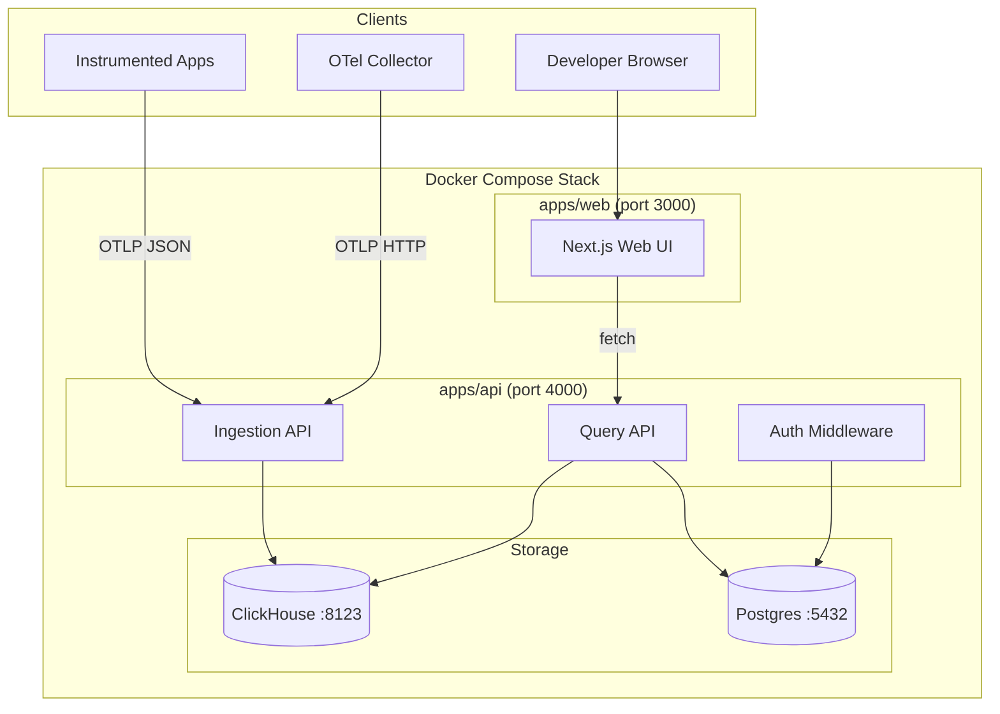
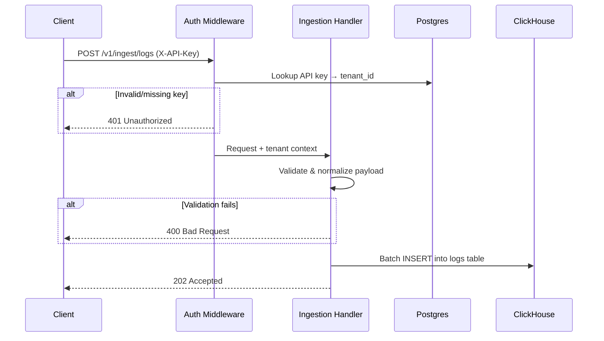

# Design Document

## Overview

RootPilot Phase 1 delivers a self-contained observability platform built as a TypeScript monorepo. The system ingests OpenTelemetry-compatible telemetry (logs, traces, metrics) and custom deployment events via a Fastify HTTP API, stores high-volume telemetry in ClickHouse and tenant metadata in Postgres, and exposes a Next.js web UI for exploration.

The architecture follows a clear separation: an **Ingestion API** receives and normalizes telemetry, a **Query API** retrieves and filters stored data, and a **Web UI** renders dashboards and explorers. All data access is tenant-scoped via API key authentication.

### Key Design Decisions

| Decision        | Choice                        | Rationale                                                                                                  |
| --------------- | ----------------------------- | ---------------------------------------------------------------------------------------------------------- |
| API framework   | Fastify                       | High throughput, schema validation via JSON Schema, first-class TypeScript support, `inject()` for testing |
| Telemetry store | ClickHouse (MergeTree)        | Columnar storage optimized for time-series append and analytical queries at scale                          |
| Metadata store  | Postgres                      | ACID guarantees for tenant/project/API key management                                                      |
| Frontend        | Next.js (App Router)          | Server components for initial load, client components for interactive explorers                            |
| Monorepo        | npm workspaces                | Zero-config workspace protocol, shared types package                                                       |
| Auth model      | API key in `X-API-Key` header | Simple, stateless, suitable for machine-to-machine ingestion                                               |
| Pagination      | Cursor-based                  | Stable pagination over append-only time-series data                                                        |
| Local infra     | Docker Compose                | Single-command local stack with health-check orchestration                                                 |

## Architecture



### Request Flow



## Components and Interfaces

### 1. Auth Middleware (`apps/api/src/middleware/auth.ts`)

Fastify `preHandler` hook that:

1. Extracts `X-API-Key` header
2. Queries Postgres for matching key (WHERE key_hash = hash(key) AND revoked_at IS NULL)
3. Attaches `tenant_id` and `project_id` to the request context
4. Returns 401 on missing, invalid, or revoked keys

```typescript
interface TenantContext {
  tenantId: string; // UUID
  projectId: string; // UUID
  keyId: string; // UUID of the API key record
}
```

### 2. Ingestion Handlers (`apps/api/src/routes/ingest/`)

Each handler follows the same pattern:

1. Parse and validate the incoming JSON payload against a JSON Schema
2. Normalize OTLP structure to the canonical model
3. Batch insert into ClickHouse
4. Return 202 Accepted

| Endpoint                      | Handler          | ClickHouse Table              |
| ----------------------------- | ---------------- | ----------------------------- |
| `POST /v1/ingest/logs`        | `logs.ts`        | `rootpilot.logs`              |
| `POST /v1/ingest/traces`      | `traces.ts`      | `rootpilot.spans`             |
| `POST /v1/ingest/metrics`     | `metrics.ts`     | `rootpilot.metrics`           |
| `POST /v1/events/deployments` | `deployments.ts` | `rootpilot.deployment_events` |

**Payload limits:**

- Max body size: 5 MB (enforced at Fastify level)
- Max log records per request: 1000
- Max spans per request: 1000 (implicit from OTLP batch size)

### 3. Query Handlers (`apps/api/src/routes/query/`)

| Endpoint                  | Response Shape                                                         |
| ------------------------- | ---------------------------------------------------------------------- |
| `GET /v1/logs`            | `{ data: Log[], pagination: { cursor, hasMore } }`                     |
| `GET /v1/traces`          | `{ data: TraceSummary[], pagination: { cursor, hasMore } }`            |
| `GET /v1/traces/:traceId` | `{ data: Span[] }`                                                     |
| `GET /v1/metrics`         | `{ metric_name, aggregation, interval, data: { timestamp, value }[] }` |
| `GET /v1/services`        | `{ data: Service[] }`                                                  |
| `GET /v1/deployments`     | `{ data: DeploymentEvent[], pagination: { cursor, hasMore } }`         |

**Common query patterns:**

- All queries include `WHERE tenant_id = :tenantId`
- Default time range: 1 hour (logs, traces, metrics) or 24 hours (services)
- Cursor-based pagination using `(timestamp, id)` composite cursor
- Cursor is base64-encoded JSON: `{ ts: string, id: string }`

### 4. Normalization Layer (`apps/api/src/normalizers/`)

Transforms OTLP JSON structures into flat canonical model records:

```typescript
// Log normalization
function normalizeLogRecords(
  resourceLogs: OTLPResourceLogs[],
  tenantId: string,
  projectId: string,
): CanonicalLog[];

// Span normalization
function normalizeSpans(
  resourceSpans: OTLPResourceSpans[],
  tenantId: string,
  projectId: string,
): CanonicalSpan[];

// Metric normalization
function normalizeMetrics(
  resourceMetrics: OTLPResourceMetrics[],
  tenantId: string,
  projectId: string,
): CanonicalMetric[];
```

**Severity mapping** (OTLP severityNumber → string):
| Range | Severity |
|-------|----------|
| 1–4 | TRACE |
| 5–8 | DEBUG |
| 9–12 | INFO |
| 13–16 | WARN |
| 17–20 | ERROR |
| 21–24 | FATAL |
| absent/invalid | INFO (default) |

**Span kind mapping** (OTLP integer → string):
| Value | Kind |
|-------|------|
| 0 | INTERNAL |
| 1 | INTERNAL |
| 2 | SERVER |
| 3 | CLIENT |
| 4 | PRODUCER |
| 5 | CONSUMER |

**Span status code mapping:**
| Value | Status |
|-------|--------|
| 0 | UNSET |
| 1 | OK |
| 2 | ERROR |

### 5. ClickHouse Client (`apps/api/src/db/clickhouse.ts`)

Uses `@clickhouse/client` with:

- Connection pooling
- Batch insert via `INSERT INTO ... FORMAT JSONEachRow`
- Parameterized queries for reads (prevents injection)
- Health check: `SELECT 1`

### 6. Postgres Client (`apps/api/src/db/postgres.ts`)

Uses `pg` (node-postgres) with:

- Connection pool (max 10 connections)
- Parameterized queries
- Health check: `SELECT 1`

### 7. Web UI (`apps/web/`)

Next.js App Router structure:

```
apps/web/src/app/
├── page.tsx              # Overview dashboard
├── logs/page.tsx         # Logs explorer
├── traces/
│   ├── page.tsx          # Trace list
│   └── [traceId]/page.tsx # Trace detail (waterfall)
├── metrics/page.tsx      # Metrics explorer
├── services/page.tsx     # Service catalog
└── settings/page.tsx     # API key & curl examples
```

Client-side data fetching via `fetch()` to the Query API at `http://localhost:4000`. API key stored in browser (for demo purposes, hardcoded demo key).

### 8. Shared Types Package (`packages/shared/`)

Exports TypeScript interfaces for:

- Canonical models (Log, Span, Metric, DeploymentEvent)
- API request/response shapes
- Query filter types
- Pagination types

## Data Models

### Postgres Schema

```sql
-- Tenants
CREATE TABLE tenants (
    id UUID PRIMARY KEY DEFAULT gen_random_uuid(),
    name VARCHAR(100) NOT NULL,
    slug VARCHAR(50) NOT NULL UNIQUE,
    created_at TIMESTAMPTZ NOT NULL DEFAULT NOW(),
    updated_at TIMESTAMPTZ NOT NULL DEFAULT NOW(),
    CONSTRAINT slug_format CHECK (slug ~ '^[a-z0-9][a-z0-9-]*[a-z0-9]$')
);

-- Projects
CREATE TABLE projects (
    id UUID PRIMARY KEY DEFAULT gen_random_uuid(),
    tenant_id UUID NOT NULL REFERENCES tenants(id),
    name VARCHAR(100) NOT NULL,
    slug VARCHAR(50) NOT NULL,
    created_at TIMESTAMPTZ NOT NULL DEFAULT NOW(),
    CONSTRAINT project_slug_format CHECK (slug ~ '^[a-z0-9][a-z0-9-]*[a-z0-9]$'),
    UNIQUE (tenant_id, slug)
);

-- API Keys
CREATE TABLE api_keys (
    id UUID PRIMARY KEY DEFAULT gen_random_uuid(),
    tenant_id UUID NOT NULL REFERENCES tenants(id),
    key_hash VARCHAR(128) NOT NULL,
    key_prefix VARCHAR(8) NOT NULL,
    name VARCHAR(100) NOT NULL,
    created_at TIMESTAMPTZ NOT NULL DEFAULT NOW(),
    revoked_at TIMESTAMPTZ
);

CREATE INDEX idx_api_keys_hash ON api_keys(key_hash);
CREATE INDEX idx_api_keys_tenant ON api_keys(tenant_id);
```

### ClickHouse Schema

```sql
-- Logs table
CREATE TABLE rootpilot.logs (
    id UUID DEFAULT generateUUIDv4(),
    tenant_id LowCardinality(String),
    project_id String,
    timestamp DateTime64(3),
    received_at DateTime64(3) DEFAULT now64(3),
    service_name LowCardinality(String),
    environment LowCardinality(String),
    source String DEFAULT '',
    resource_attributes String DEFAULT '{}',
    attributes String DEFAULT '{}',
    severity LowCardinality(String),
    message String,
    trace_id String DEFAULT '',
    span_id String DEFAULT '',
    fingerprint String DEFAULT ''
)
ENGINE = MergeTree
PARTITION BY toYYYYMM(timestamp)
ORDER BY (tenant_id, service_name, timestamp)
TTL toDateTime(timestamp) + INTERVAL 90 DAY;

-- Spans table
CREATE TABLE rootpilot.spans (
    id UUID DEFAULT generateUUIDv4(),
    tenant_id LowCardinality(String),
    project_id String,
    timestamp DateTime64(3),
    received_at DateTime64(3) DEFAULT now64(3),
    service_name LowCardinality(String),
    environment LowCardinality(String),
    source String DEFAULT '',
    resource_attributes String DEFAULT '{}',
    attributes String DEFAULT '{}',
    trace_id String,
    span_id String,
    parent_span_id String DEFAULT '',
    operation_name String,
    duration_ms Float64,
    status_code LowCardinality(String),
    status_message String DEFAULT '',
    kind LowCardinality(String)
)
ENGINE = MergeTree
PARTITION BY toYYYYMM(timestamp)
ORDER BY (tenant_id, trace_id, timestamp)
TTL toDateTime(timestamp) + INTERVAL 90 DAY;

-- Metrics table
CREATE TABLE rootpilot.metrics (
    id UUID DEFAULT generateUUIDv4(),
    tenant_id LowCardinality(String),
    project_id String,
    timestamp DateTime64(3),
    received_at DateTime64(3) DEFAULT now64(3),
    service_name LowCardinality(String),
    environment LowCardinality(String),
    source String DEFAULT '',
    resource_attributes String DEFAULT '{}',
    attributes String DEFAULT '{}',
    metric_name LowCardinality(String),
    metric_type LowCardinality(String),
    value Float64,
    unit String DEFAULT '',
    labels String DEFAULT '{}'
)
ENGINE = MergeTree
PARTITION BY toYYYYMM(timestamp)
ORDER BY (tenant_id, metric_name, timestamp)
TTL toDateTime(timestamp) + INTERVAL 90 DAY;

-- Deployment Events table
CREATE TABLE rootpilot.deployment_events (
    deployment_id UUID DEFAULT generateUUIDv4(),
    tenant_id LowCardinality(String),
    project_id String,
    timestamp DateTime64(3),
    service_name LowCardinality(String),
    environment LowCardinality(String),
    version String,
    git_sha String DEFAULT '',
    deployed_by String DEFAULT '',
    provider String DEFAULT '',
    metadata String DEFAULT '{}'
)
ENGINE = MergeTree
PARTITION BY toYYYYMM(timestamp)
ORDER BY (tenant_id, service_name, timestamp)
TTL toDateTime(timestamp) + INTERVAL 90 DAY;
```

### Canonical Model TypeScript Types (`packages/shared`)

```typescript
export interface CanonicalLog {
  id: string;
  tenant_id: string;
  project_id: string;
  timestamp: string; // ISO 8601
  received_at: string; // ISO 8601
  service_name: string;
  environment: string;
  source: string;
  resource_attributes: Record<string, string>;
  attributes: Record<string, string>;
  severity: 'TRACE' | 'DEBUG' | 'INFO' | 'WARN' | 'ERROR' | 'FATAL';
  message: string;
  trace_id: string;
  span_id: string;
  fingerprint: string;
}

export interface CanonicalSpan {
  id: string;
  tenant_id: string;
  project_id: string;
  timestamp: string;
  received_at: string;
  service_name: string;
  environment: string;
  source: string;
  resource_attributes: Record<string, string>;
  attributes: Record<string, string>;
  trace_id: string;
  span_id: string;
  parent_span_id: string | null;
  operation_name: string;
  duration_ms: number;
  status_code: 'UNSET' | 'OK' | 'ERROR';
  status_message: string;
  kind: 'INTERNAL' | 'SERVER' | 'CLIENT' | 'PRODUCER' | 'CONSUMER';
}

export interface CanonicalMetric {
  id: string;
  tenant_id: string;
  project_id: string;
  timestamp: string;
  received_at: string;
  service_name: string;
  environment: string;
  source: string;
  resource_attributes: Record<string, string>;
  attributes: Record<string, string>;
  metric_name: string;
  metric_type: 'gauge' | 'sum' | 'histogram';
  value: number;
  unit: string;
  labels: Record<string, string>;
}

export interface CanonicalDeploymentEvent {
  deployment_id: string;
  tenant_id: string;
  project_id: string;
  timestamp: string;
  service_name: string;
  environment: string;
  version: string;
  git_sha: string;
  deployed_by: string;
  provider: string;
  metadata: Record<string, unknown>;
}
```

### Pagination Types

```typescript
export interface PaginationParams {
  limit?: number;
  cursor?: string; // base64-encoded { ts: string, id: string }
}

export interface PaginatedResponse<T> {
  data: T[];
  pagination: {
    cursor: string | null;
    hasMore: boolean;
  };
}
```

## Correctness Properties

_A property is a characteristic or behavior that should hold true across all valid executions of a system — essentially, a formal statement about what the system should do. Properties serve as the bridge between human-readable specifications and machine-verifiable correctness guarantees._

### Property 1: Ingestion Round-Trip Preservation

_For any_ valid telemetry payload (log, span, metric, or deployment event) with any combination of valid field values, ingesting the payload via the corresponding endpoint and then querying it back SHALL produce a record whose canonical fields match the original input values (after normalization).

**Validates: Requirements 2.1, 3.1, 4.1, 5.1**

### Property 2: Severity Number Mapping Correctness

_For any_ integer value, the severity mapping function SHALL return the correct severity string according to the defined ranges (1-4→TRACE, 5-8→DEBUG, 9-12→INFO, 13-16→WARN, 17-20→ERROR, 21-24→FATAL), and for any value outside 1-24 or absent, SHALL return INFO.

**Validates: Requirements 2.6**

### Property 3: Span Duration Computation

_For any_ span with startTimeUnixNano and endTimeUnixNano where endTimeUnixNano ≥ startTimeUnixNano, the computed duration_ms SHALL equal (endTimeUnixNano - startTimeUnixNano) / 1,000,000 with no precision loss beyond floating-point representation.

**Validates: Requirements 3.1**

### Property 4: Payload Validation Rejection

_For any_ ingestion payload that violates structural validation rules (missing required fields, invalid field types, invalid enum values such as span kind or status_code, non-JSON content), the corresponding endpoint SHALL return HTTP 400 with an error message of at least 10 characters describing the validation failure, and SHALL NOT persist any data from the request.

**Validates: Requirements 2.2, 3.2, 3.5, 4.2, 5.2, 21.7**

### Property 5: Missing Field Defaults

_For any_ ingestion payload where optional temporal fields are absent (timestamp on logs or deployment events, deployment_id on deployment events), the system SHALL assign server-generated values: current server time for timestamps, and a valid UUID for deployment_id.

**Validates: Requirements 2.5, 5.4, 5.5**

### Property 6: Tenant Data Isolation

_For any_ two distinct tenants A and B, and any data ingested under tenant A, querying via tenant B's API key SHALL return zero records belonging to tenant A. Additionally, for any random string that does not match a valid API key, the system SHALL return HTTP 401.

**Validates: Requirements 1.6, 18.1, 18.2, 18.3**

### Property 7: Cross-Tenant Resource Not-Found

_For any_ resource (trace, log, deployment) that exists under tenant A, a direct lookup of that resource's identifier using tenant B's API key SHALL return HTTP 404, indistinguishable from a genuinely non-existent resource.

**Validates: Requirements 18.4, 8.6**

### Property 8: Query Filtering Correctness

_For any_ set of stored telemetry records and any combination of valid filter parameters (time range, service_name, environment, severity, message search, minDuration, metric_name), the query endpoint SHALL return exactly those records that match ALL specified filters, and no records that fail any filter. Text search on message fields SHALL be case-insensitive.

**Validates: Requirements 7.3, 7.4, 8.4, 9.3, 10.2, 10.3**

### Property 9: Cursor-Based Pagination Consistency

_For any_ query result set larger than the page size, iterating through all pages using the returned cursor SHALL yield every record exactly once, in timestamp-descending order (or ascending for metrics), with no duplicates and no gaps. The final page SHALL have `hasMore: false`.

**Validates: Requirements 7.1, 8.2, 9.5**

### Property 10: Query Parameter Validation

_For any_ query request containing invalid parameter values (malformed ISO-8601 timestamps, negative durations, limit exceeding maximum, unsupported interval or aggregation values, unrecognized severity), the query endpoint SHALL return HTTP 400 with a descriptive error message and SHALL NOT execute any database query.

**Validates: Requirements 7.7, 8.7, 9.6**

### Property 11: Metric Aggregation Correctness

_For any_ set of metric data points within a time range and any valid aggregation function (avg, sum, min, max, count) with a valid interval (1m, 5m, 15m, 1h, 1d), the returned aggregated values SHALL equal the mathematical result of applying that function to the data points within each interval bucket.

**Validates: Requirements 9.4**

### Property 12: Service Catalog Aggregation

_For any_ set of telemetry records (logs, spans, metrics) across multiple services, the services endpoint SHALL return one entry per unique (service_name, environment) pair with correct counts (log_count, span_count, metric_count) and the most recent timestamp as last_seen.

**Validates: Requirements 10.1**

## Error Handling

### API Error Response Format

All API errors follow a consistent JSON structure:

```typescript
interface ErrorResponse {
  error: {
    code: string; // Machine-readable error code
    message: string; // Human-readable description (≥10 chars per Req 21.7)
    details?: unknown; // Optional structured details
  };
}
```

### Error Categories

| HTTP Status | Code                    | When                                                  |
| ----------- | ----------------------- | ----------------------------------------------------- |
| 400         | `INVALID_PAYLOAD`       | Request body fails JSON Schema validation             |
| 400         | `PAYLOAD_TOO_LARGE`     | Body exceeds 5 MB                                     |
| 400         | `RECORD_LIMIT_EXCEEDED` | Log records > 1000 per request                        |
| 400         | `INVALID_PARAMETER`     | Query parameter fails validation                      |
| 401         | `AUTH_REQUIRED`         | Missing X-API-Key header                              |
| 401         | `AUTH_INVALID`          | Key not found in database                             |
| 401         | `AUTH_REVOKED`          | Key exists but revoked_at is set                      |
| 404         | `NOT_FOUND`             | Resource doesn't exist (or belongs to another tenant) |
| 500         | `INTERNAL_ERROR`        | Unexpected server error                               |

### Error Handling Strategy

1. **Validation errors** — Return immediately with 400, no DB operations executed
2. **Auth errors** — Return immediately with 401, no DB operations executed
3. **ClickHouse write failures** — Log error, return 500 with generic message (no data leak)
4. **ClickHouse read failures** — Log error, return 500 with generic message
5. **Postgres connection failures** — Auth middleware returns 500 (cannot verify key)

### Graceful Degradation

- If ClickHouse is temporarily unavailable during ingestion, the API returns 503 (Service Unavailable) with a `Retry-After` header
- The Web UI displays error banners when API calls fail, preserving user filter state (Req 12.5)
- The `db:init` script exits with non-zero code and descriptive error within 30 seconds if databases are unreachable (Req 19.4)

## Testing Strategy

### Test Framework and Configuration

- **Framework**: Vitest (as specified in Req 21.8)
- **HTTP testing**: Fastify `inject()` — no real HTTP server needed
- **Test isolation**: Dedicated test tenant per test suite, isolated from seed data
- **Database**: Tests run against real ClickHouse and Postgres instances (via Docker Compose test profile)

### Property-Based Testing

**Library**: [fast-check](https://github.com/dubzzz/fast-check) (TypeScript PBT library for Vitest)

**Configuration**:

- Minimum 100 iterations per property test
- Each property test tagged with: `Feature: rootpilot-phase1-observability-core, Property {N}: {title}`
- Custom arbitraries for OTLP payload generation

**Property tests cover**:

- Ingestion round-trip (Property 1)
- Severity mapping (Property 2)
- Duration computation (Property 3)
- Validation rejection (Property 4)
- Missing field defaults (Property 5)
- Tenant isolation (Property 6)
- Cross-tenant not-found (Property 7)
- Query filtering (Property 8)
- Pagination consistency (Property 9)
- Parameter validation (Property 10)
- Aggregation correctness (Property 11)
- Service catalog aggregation (Property 12)

### Unit Tests (Example-Based)

Unit tests complement property tests for specific scenarios:

| Area                | Tests                                                     |
| ------------------- | --------------------------------------------------------- |
| Auth middleware     | Valid key → 202/200, missing key → 401, revoked key → 401 |
| Default time ranges | Query without time range returns last 1 hour of data      |
| Empty results       | Query with no matches returns 200 with empty array        |
| Trace not-found     | Non-existent traceId returns 404                          |
| Seed script         | Demo tenant, project, and API key exist after seeding     |

### Integration Tests

- Docker Compose full-stack startup within 120 seconds
- Seed script populates minimum data counts (50 logs, 10 traces, 20 metrics, 3 deployments)
- OTel Collector config is valid YAML with required sections

### Frontend Tests

- Component rendering with mock data (React Testing Library)
- Filter interactions trigger correct API calls
- Empty and error states render appropriate messages
- Waterfall visualization renders spans with correct positioning

### Test Organization

```
apps/api/src/__tests__/
├── auth.test.ts              # Auth middleware tests
├── ingest/
│   ├── logs.test.ts          # Log ingestion (unit + property)
│   ├── traces.test.ts        # Trace ingestion (unit + property)
│   ├── metrics.test.ts       # Metric ingestion (unit + property)
│   └── deployments.test.ts   # Deployment ingestion (unit + property)
├── query/
│   ├── logs.test.ts          # Log query (unit + property)
│   ├── traces.test.ts        # Trace query (unit + property)
│   ├── metrics.test.ts       # Metric query (unit + property)
│   ├── services.test.ts      # Services query (unit + property)
│   └── deployments.test.ts   # Deployment query (unit + property)
├── isolation.test.ts         # Tenant isolation property tests
└── helpers/
    ├── arbitraries.ts        # fast-check custom generators
    ├── test-tenant.ts        # Test tenant setup/teardown
    └── fixtures.ts           # Static test fixtures

apps/web/src/__tests__/
├── overview.test.tsx
├── logs-explorer.test.tsx
├── trace-explorer.test.tsx
├── metrics-explorer.test.tsx
├── service-catalog.test.tsx
└── settings.test.tsx
```
