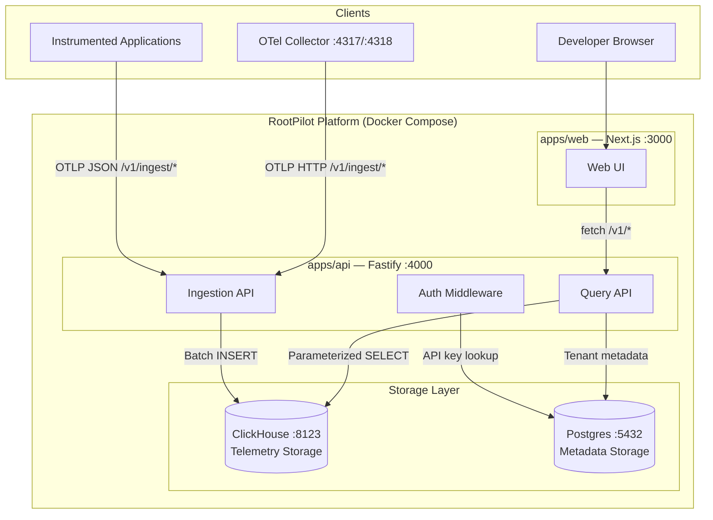
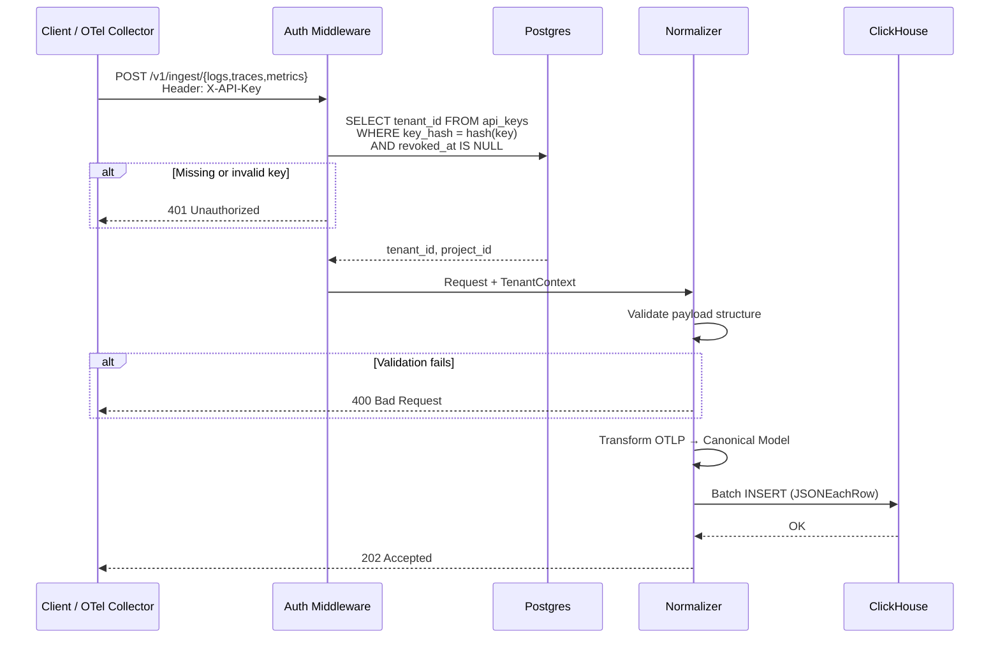
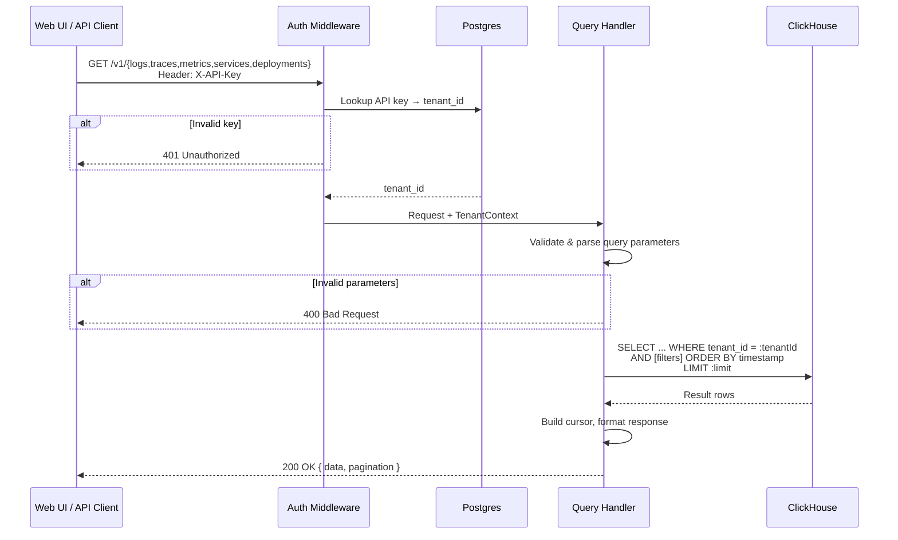
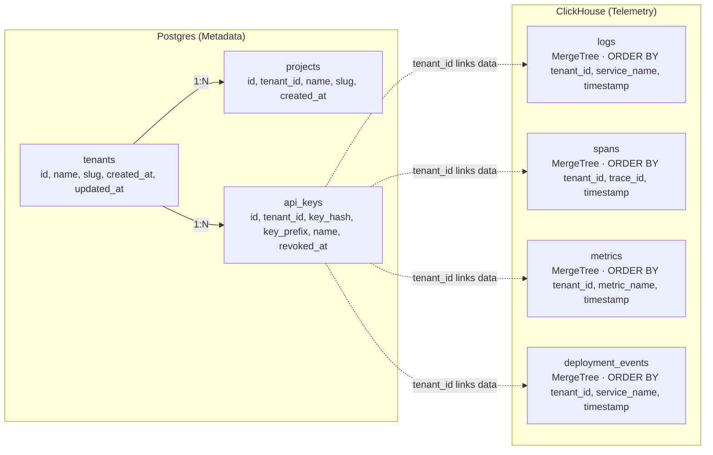

# RootPilot Architecture

## High-Level System Diagram

The following diagram shows all components in the RootPilot observability platform and how they connect.

### Component Summary

| Component | Technology | Port | Responsibility |
|-----------|-----------|------|----------------|
| Ingestion API | Fastify (TypeScript) | 4000 | Receives OTLP telemetry, normalizes, stores in ClickHouse |
| Query API | Fastify (TypeScript) | 4000 | Serves filtered, paginated queries over stored telemetry |
| Web UI | Next.js (App Router) | 3000 | Interactive dashboards and explorers for logs, traces, metrics |
| ClickHouse | ClickHouse (MergeTree) | 8123 | High-volume columnar storage for telemetry data |
| Postgres | PostgreSQL | 5432 | Tenant metadata, projects, API key management |
| OTel Collector | OpenTelemetry Collector | 4317/4318 | Optional — forwards telemetry from instrumented apps to RootPilot |

---

## Data Flow

### Ingestion Flow

Data flows from instrumented applications through authentication and normalization into ClickHouse storage.

### Query Flow

The query path retrieves stored telemetry with tenant scoping enforced at every query.

### Endpoints Overview

| Method | Endpoint | Flow | Storage |
|--------|----------|------|---------|
| POST | `/v1/ingest/logs` | Ingestion | ClickHouse `rootpilot.logs` |
| POST | `/v1/ingest/traces` | Ingestion | ClickHouse `rootpilot.spans` |
| POST | `/v1/ingest/metrics` | Ingestion | ClickHouse `rootpilot.metrics` |
| POST | `/v1/events/deployments` | Ingestion | ClickHouse `rootpilot.deployment_events` |
| GET | `/v1/logs` | Query | ClickHouse `rootpilot.logs` |
| GET | `/v1/traces` | Query | ClickHouse `rootpilot.spans` |
| GET | `/v1/traces/:traceId` | Query | ClickHouse `rootpilot.spans` |
| GET | `/v1/metrics` | Query | ClickHouse `rootpilot.metrics` |
| GET | `/v1/services` | Query | ClickHouse (aggregated) |
| GET | `/v1/deployments` | Query | ClickHouse `rootpilot.deployment_events` |

---

## Storage Design

RootPilot uses a dual-database architecture: ClickHouse for high-volume telemetry and Postgres for tenant metadata.

### Postgres Schema

Postgres stores tenant configuration and API key credentials with ACID guarantees.

| Table | Purpose | Key Fields |
|-------|---------|-----------|
| `tenants` | Organizations | id (UUID PK), name, slug (unique), created_at, updated_at |
| `projects` | Logical groupings within a tenant | id (UUID PK), tenant_id (FK), name, slug, unique(tenant_id, slug) |
| `api_keys` | Authentication credentials | id (UUID PK), tenant_id (FK), key_hash, key_prefix, revoked_at |

### ClickHouse Schema

ClickHouse stores high-volume telemetry using the MergeTree engine optimized for time-series append and analytical queries.

| Table | Engine | Partition | Order | TTL |
|-------|--------|-----------|-------|-----|
| `rootpilot.logs` | MergeTree | `toYYYYMM(timestamp)` | `(tenant_id, service_name, timestamp)` | 90 days |
| `rootpilot.spans` | MergeTree | `toYYYYMM(timestamp)` | `(tenant_id, trace_id, timestamp)` | 90 days |
| `rootpilot.metrics` | MergeTree | `toYYYYMM(timestamp)` | `(tenant_id, metric_name, timestamp)` | 90 days |
| `rootpilot.deployment_events` | MergeTree | `toYYYYMM(timestamp)` | `(tenant_id, service_name, timestamp)` | 90 days |

**Column type choices:**

- `LowCardinality(String)` for `tenant_id`, `service_name`, `environment` — reduces memory usage for high-cardinality but repetitive values
- `DateTime64(3)` for timestamps — millisecond precision for accurate telemetry ordering
- `String` with JSON for `resource_attributes`, `attributes`, `labels` — flexible key-value storage without schema changes

---

## Multi-Tenant Isolation Strategy

RootPilot enforces strict tenant isolation at the application layer. Every data access path is scoped to the authenticated tenant.

```mermaid
flowchart TD
    REQ[Incoming Request] --> EXTRACT[Extract X-API-Key header]
    EXTRACT --> LOOKUP[Query Postgres:<br/>SELECT tenant_id FROM api_keys<br/>WHERE key_hash = hash&#40;key&#41;<br/>AND revoked_at IS NULL]

    LOOKUP -->|No match| REJECT_401[Return 401 Unauthorized]
    LOOKUP -->|Key revoked| REJECT_401
    LOOKUP -->|Valid key| RESOLVE[Resolve tenant_id + project_id]

    RESOLVE --> CONTEXT[Attach TenantContext to request]

    CONTEXT --> WRITE{Write path?}
    WRITE -->|Yes - Ingestion| TAG[Tag every record<br/>with tenant_id]
    TAG --> INSERT[INSERT INTO ClickHouse<br/>with tenant_id column]

    WRITE -->|No - Query| SCOPE[Inject WHERE tenant_id = :tenantId<br/>into every query]
    SCOPE --> RESULT[Return only tenant's data]

    RESULT --> CROSS{Resource exists<br/>under different tenant?}
    CROSS -->|Yes| NOT_FOUND[Return 404 Not Found<br/>&#40;indistinguishable from missing&#41;]
    CROSS -->|No| RETURN[Return data to client]
```

### Isolation Guarantees

| Layer | Mechanism | Enforcement |
|-------|-----------|-------------|
| **Authentication** | API key → tenant_id lookup | Auth middleware (preHandler hook) rejects requests before any DB operation |
| **Ingestion** | Every record tagged with `tenant_id` | Normalizers stamp tenant_id from TenantContext onto all canonical records |
| **Query** | `WHERE tenant_id = :tenantId` in every query | Query handlers inject tenant filter as parameterized value (prevents injection) |
| **Cross-tenant access** | 404 instead of 403 | Lookup by resource ID returns "not found" if tenant doesn't own the resource |
| **Client-supplied tenant_id** | Ignored | The system always uses the tenant_id resolved from the API key, never from request params/body |

### Key Design Decisions

1. **No shared queries** — There is no admin endpoint or cross-tenant query. Every ClickHouse query includes the tenant_id filter.
2. **Parameterized queries** — Tenant IDs are passed as query parameters, not interpolated into SQL strings, preventing injection attacks.
3. **Opaque 404** — When a resource belongs to a different tenant, the API returns 404 (not 403), preventing information leakage about resource existence.
4. **Stateless auth** — Each request is independently authenticated via the API key header. No sessions or tokens to manage.
